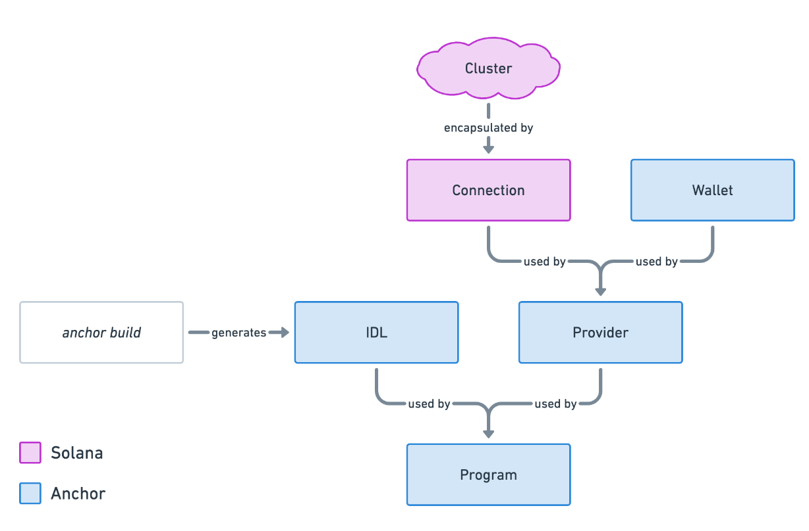

# Solana / Ethereum : Visibilité des fonctions


(*Photo : James Frid - [Pexels](https://www.pexels.com/fr-fr/photo/telescope-gris-et-or-sur-batiment-901974/)*)


## TL;DR

1. Cet article sert de pense-bête sur la visibilité des fonctions des smart-contracts Solana.
2. Une comparaison sera faite entre Rust & Anchor sur Solana et Solidity sur Ethereum.
3. Les fonctions des smart-contracts définissent le comportement et les actions d'un contrat sur une blockchain.
3. La visibilité des fonctions spécifie leur accesibilité depuis l'intérieur ou l'extérieur d'une blockchain.


## Introduction

Les smart-contracts sont un élément essentiel de l'écosystème blockchain, offrant des fonctionnalités décentralisées et autonomes qui sous-tendent un large éventail d'applications.

Dans cet article, nous explorerons **la visibilité des fonctions des smart-contracts en Rust sur la blockchain Solana**, l'objectif est surtout d'aider ceux qui viennent d'Ethereum et qui connaissent Solidity à mieux comprendre Solana.

Si **Rust** est un langage très **puissant et généraliste**, parfaitement adapté à une grande variété de développement, **Solidity** est spécifique à l'écriture de **smart-contracts** pour les EVM, notament sur la blockchain Ethereum.

Vous pouvez pratiquer, tester et expérimenter du code grace à des *"sandbox"* en ligne :
- En **Solidity** à l'aide de [**Remix**](https://remix.ethereum.org/), une plateforme pour les smart-contracts Ethereum.
- Pour **Rust/Anchor**, vous pouvez utiliser [**Playground**](https://beta.solpg.io/), une interface offrant un environnement pour écrire et tester des contrats Solana.
- En outre, pour **Rust**, vous pouvez utiliser [**Code Explorer**](https://godbolt.org/), mais spécifiquement pour ce langage en le sélectionnant.


## Solidity

Les fonctions des smart-contracts en [**Solidity**](https://soliditylang.org/) (🇬🇧) sont des blocs de code qui définissent le comportement et les fonctionnalités d'un contrat sur la blockchain **Ethereum**.

Voici quelques points clés à connaitre à ce sujet :

- **Déclaration** : Les fonctions sont déclarées à l'intérieur du contrat à l'aide du mot-clé `function`.
- **Visibilité** : Les fonctions peuvent avoir différents niveaux de visibilité, tels que `external`, `public`, `private` et `internal` qui déterminent comment elles peuvent être appelées ou pas depuis l'extérieur du contrat.
- **Mutabilité** : La mutabilité d'une fonction est définie par les mots-clés `view` (*accès aux données stockées existantes sans modification*) ou `pure` (*aucun accès ou modification*).
- **Recevabilité** : `payable` Autorise la fonction à recevoir des paiements lors de son exécution.
- **Paramètres** : Les fonctions peuvent accepter des paramètres de différents types de données, tels que des entiers, des chaînes de caractères, des tableaux, etc.
- **Valeurs de retour** : Les fonctions peuvent également renvoyer des valeurs après leur exécution. Vous pouvez spécifier le type de valeur de retour à l'aide du mot-clé `returns`.
- **Décorateurs** : Les décorateurs sont des morceaux de code réutilisables qui peuvent modifier le comportement d'une fonction (*mot-clef `modifier`*). Ils sont souvent utilisés pour ajouter des conditions de sécurité ou des vérifications préalables à l'exécution de la fonction.
- **Événements** : Les fonctions peuvent émettre des événements à l'aide du mot-clé `emit`. Les événements sont utiles pour notifier les clients externes de l'état ou des actions importantes effectuées par le contrat.

### Visibilité en Solidity

Voici un récapitulatif des différents niveaux de visibilité disponibles pour les fonctions en **Solidity** :

- **Externe (`external`)** : Les fonctions externes sont similaires aux fonctions publiques, mais elles ne peuvent être appelées que depuis l'extérieur de la blockchain (*c'est-à-dire par d'autres contrats ou par des transactions externes*). Elles ne peuvent pas être appelées depuis l'intérieur du contrat qui les définit.
- **Publique (`public`)** : Les fonctions publiques peuvent être appelées depuis n'importe où, à la fois à l'intérieur du contrat qui les définit et depuis d'autres contrats ou depuis l'extérieur de la blockchain. Elles sont généralement utilisées pour définir des points d'entrée pour interagir avec le contrat.
- **Privé (`private`)** : Les fonctions privées ne peuvent être appelées que depuis d'autres fonctions définies dans le même contrat. Elles ne sont pas accessibles depuis l'extérieur du contrat ou depuis d'autres contrats. Elles sont généralement utilisées pour encapsuler la logique interne du contrat et pour éviter toute interférence externe.
- **Interne (`internal`)** : Les fonctions internes sont semblables aux fonctions privées, mais elles peuvent également être appelées depuis les contrats dérivés (*hérités*). Elles ne sont pas accessibles depuis l'extérieur du contrat.


### Exemple en Solidity

```solidity
// SPDX-License-Identifier: GPL-3.0

pragma solidity >=0.8.2 <0.9.0;

// Contract A
contract ContractA {
    // Variable d'état publique
    uint256 public publicVariable;

    // Variable d'état privée
    uint256 private privateVariable;

    // Constructeur du contrat
    constructor(uint256 _initialValue) {
        publicVariable = _initialValue;
        privateVariable = _initialValue;
    }

    // Fonction publique
    function publicFunction() public returns (uint256) {
        return publicVariable;
    }

    // Fonction privée
    function privateFunction() private returns (uint256) {
        return privateVariable;
    }

    // Fonction externe
    function externalFunction() external returns (uint256) {
        // Appel de la fonction privée à partir d'une fonction publique
        return privateFunction();
    }

    // Fonction interne
    function internalFunction() internal returns (uint256) {
        return privateVariable;
    }

}

// Contract B
contract ContractB {
    // Déclaration d'une instance du contrat A
    ContractA instanceOfContractA;

    // Fonction publique qui appelle une fonction publique du contrat A
    function usePublicFunctionContractA() public returns (uint256) {
        // Création d'une nouvelle instance du contrat A
        instanceOfContractA = new ContractA(10);
        // Appel de la fonction publique du contrat A
        return instanceOfContractA.publicFunction();
    }

//    // Fonction publique qui appelle une fonction privée du contrat A
//    function usePrivateFunctionContractA() public returns (uint256) {
//        // Appel de la fonction privée du contrat A
//        return instanceOfContractA.privateFunction(); // Erreur de compilation : privateFunction n'est pas visible ici
//    }

//    // Fonction publique qui appelle une fonction interne du contrat A
//    function useInternalFunctionContractA() public returns (uint256) {
//        // Appel de la fonction interne du contrat A
//        return instanceOfContractA.internalFunction(); // Erreur de compilation : internalFunction n'est pas visible ici
//    }

}

// Inherited
contract Inherited is ContractA(42) {

//    // Fonction publique qui appelle une fonction privée du contrat A
//    function usePrivateFunctionContractA() public returns (uint256) {
//       // Appel de la fonction privée du contrat A
//        return privateFunction(); // Erreur de compilation : privateFunction n'est pas visible ici
//    }

    // Fonction publique qui appelle une fonction interne du contrat A
    function useInternalFunctionContractA() public returns (uint256) {
        // Appel de la fonction interne héritée du contrat A
        return internalFunction();
    }

}
```

En choisissant le niveau de visibilité approprié pour chaque fonction, les développeurs peuvent contrôler comment ces fonctions sont [**accessibles**](assets/outside_contracts.png) (*Remix*) et [**utilisables**](assets/abi.json) (*ABI*), ce qui contribue à la **sécurité** et à la **clarté** du contrat.


## Rust & Anchor

Avec la blockchain **Solana**, les fonctions des smart-contracts sont définies à l'aide du langage [**Rust**](https://www.rust-lang.org/) (🇬🇧) et du framework [**Anchor**](https://www.anchor-lang.com/) (🇬🇧) qui simplifie le processus de création, de déploiement et de gestion des contrats pour Solana.

Voici quelques éléments clés à savoir :

- **Déclaration** : Les fonctions sont définies à l'intérieur d'une structure de données définissant le smart-contrat Solana et annotées avec des attributs spécifiques à Anchor.
- **Attributs spécifiques** : Anchor fournit plusieurs attributs spécifiques pour annoter les fonctions des contrats Solana, tels que `#[instruction]` pour les instructions, `#[state]` pour les états et `#[derive(Accounts)]` pour la spécification des comptes nécessaires à l'exécution de la fonction.
- **Fonctions d'instruction** : Les fonctions marquées avec l'attribut `#[instruction]` sont des instructions du contrat Solana qui peuvent être appelées depuis l'extérieur de la chaîne. Elles définissent les fonctionnalités et les actions du contrat.
- **Fonctions de vérification** : Les fonctions de vérification sont utilisées pour valider les transactions et peuvent être marquées avec l'attribut `#[instruction]` pour indiquer qu'elles sont appelées en tant qu'instructions, ou avec l'attribut `#[guard]` pour indiquer qu'elles sont utilisées pour la validation uniquement.
- **Gestion des comptes** : Anchor facilite la gestion des comptes nécessaires à l'exécution des fonctions en utilisant l'attribut `#[derive(Accounts)]` qui spécifie les comptes impliqués dans une transaction et leur rôle (*par exemple, compte source, compte destinataire, compte d'état du contrat, etc.*).

### Visibilité avec Rust & Anchor

#### Externe / Publique

> La **distinction** entre publique et externe **n'existe pas** avec Anchor.

Si cette distinction existe avec Solidity, elle est liée à la définition faite par langage lui-même et au compilateur. Elle sert principalement à l'organisation du code en limitant l'accès via le mot-clé `external`.

En **Rust** avec **Anchor**, une fonction est **publique** de par l'usage du mot clef `pub` qui la rend [**accessible**](https://doc.rust-lang.org/std/keyword.pub.html) (🇬🇧) depuis l'extérieur du module qui la définit.

`mod` est utilisé pour déclarer un module dans Rust. Un [**module**](https://doc.rust-lang.org/std/keyword.mod.html) (🇬🇧) est un regroupement d'éléments à des fins de structuration du code.

Le module (`mod`) doit d'être "*estampillé*" avec la [**macro-attribut `#[program]`**](https://docs.rs/anchor-lang/latest/anchor_lang/attr.program.html) (🇬🇧) définie par le framework Anchor, permettant de définir le module comme un contrat étant un contrat intelligent, ses fonctions devenant des points d'entrée pour les transactions sur Solana.

**Illustration :**
```rust
// ...

#[program]
pub mod contract {
    use super::*;

    pub fn public_function(ctx: Context<Initialize>) -> Result<()> {
        // ...
        Ok(())
    }
}

// ...
```

#### Interne / Privé

- Rust n'a pas de notion de "classes" comme l'a Solidity, car Rust n'est pas un langage orienté objet (*mais une approche objet est possible et convaincante*).
- La distinction entre "private" et "internal" ne peux être directement applicable à Rust.

Les modules permettent d'organiser le code. [**La visibilité des fonctions par rapport aux modules**](https://doc.rust-lang.org/beta/reference/visibility-and-privacy.html) (🇬🇧) existe bien, mais il nous faut y porter un regard différent lié au contexte de Solana.

> **Interne et privé** sont des visibilités antagonistes à **externe et publique**.

Elles dépendent de deux éléments :
- Leurs liens avec les modules (`mod`)
- Et si le module est destiné à être un contrat (`#[program]`).

##### Privé

L'analogie au `private` de Solidity peut être obtenue en définissant la fonction à l'intérieur du module du contrat et en faisant en sorte à ce qu'elle soit **inaccessible de l'extérieur du module**.

```rust
// ...

#[program]
pub mod contract {
    use super::*;

    pub fn initialize(_ctx: Context<Initialize>) -> Result<()> {
        // ...
        private::private_function();
        // ...
        Ok(())
    }

    pub mod private {
        pub(in crate::contract) fn private_function() {
            // ...
        }
    }
}

mod other_module {
    use crate::contract;

    pub fn function() {
        // ...
        contract::private::private_function();
        // ...
    }
}

// ...
```

Si on lance une compilation via la **commande `anchor build`**, on obtiendra l'erreur suivante :

```bash
error[E0603]: function `private_function` is private
  --> programs/visibility/src/lib.rs:39:28
   |
39 |         contract::private::private_function();
   |                            ^^^^^^^^^^^^^^^^ private function
   |
note: the function `private_function` is defined here
  --> programs/visibility/src/lib.rs:26:9
   |
26 |         pub(in crate::contract) fn private_function() {
   |         ^^^^^^^^^^^^^^^^^^^^^^^^^^^^^^^^^^^^^^^^^^^^^
```

Qui est bien ce que nous voulions obtenir.
- La fonction `private_function()` est bien **inaccessible** à la compilation, car hors du module.
- Le compilateur la considère comme **privée**.

##### Interne

Pour obtenir un équivalent du `internal` de Solidity, il suffit de définir la fonction à l'intérieur du module du contrat et de la rendre accessible aussi bien à l'intérieur qu'à l'extérieur de ce module.

```rust
// ...

#[program]
pub mod contract {
    use super::*;

    pub fn initialize(_ctx: Context<Initialize>) -> Result<()> {
        // ...
        internal::internal_function();
        // ...
        Ok(())
    }

    pub mod internal {
        pub fn internal_function() {
            // ...
        }
    }
}

mod other_module {
    use crate::contract;

    pub fn function() {
        // ...
        contract::internal::internal_function();
        // ...
    }
}

// ...
```

### Exemple avec Rust & Anchor

Le programme ci-dessous, résume l'obtention des visibilités en utilisant le langage **Rust et Anchor**. Il essaie de reproduire les concepts de visibilité de Solidity (*voir exemple précédent*).

```rust
use anchor_lang::prelude::*;

declare_id!("5gxeL3AFd6utfoUjuRxRHyFbujXEZuUdFonBXNwaas64");
// La macro `declare_id!` dans le framework Anchor est utilisée pour déclarer
// et générer automatiquement un identifiant unique pour un programme.

#[program]
pub mod contract {
    use super::*;

    pub fn initialize(ctx: Context<Initialize>) -> Result<()> {
        internal::internal_function();
        private::private_function();
        Ok(())
    }

    pub fn public_function(ctx: Context<Initialize>) -> Result<()> {
        // ...
        Ok(())
    }

    pub mod internal {
        pub fn internal_function() {
            // ...
        }
    }

    pub mod private {
        pub(in crate::contract) fn private_function() {
            // ...
        }
    }

}

mod other_module {
    use crate::contract;

    pub fn function() {
        // ...
        contract::internal::internal_function();
        //contract::private::private_function();
        // error[E0603]: function `private_function` is private
        // ...
    }
}

#[derive(Accounts)]
pub struct Initialize {}
``` 

On retrouve avec Anchor l'équivalent des données **ABI** de Solidity qui expose les points d'entrée. Il s'agit des données [**IDL** (*Interface Description Language*)](https://fr.wikipedia.org/wiki/Interface_Description_Language) (🇫🇷) qui servent à définir l'interface entre un smart-contract Solana et les applications clientes.

Elles spécifient la structure des données et les fonctions disponibles, facilitant ainsi l'interaction et la communication entre les contrats intelligents et les applications externes. Ces données au format [**JSON**](https://www.json.org/json-fr.html) (🇫🇷) sont générées lors du build du projet Solana.


(*Source : [SolDev - Intro to client-side Anchor development](https://www.soldev.app/course/intro-to-anchor-frontend)*)

Fichier : "*contract.json*"
```json
{
  "version": "0.1.0",
  "name": "contract",
  "instructions": [
    {
      "name": "initialize",
      "accounts": [],
      "args": []
    },
    {
      "name": "publicFunction",
      "accounts": [],
      "args": []
    }
  ]
}
```

**Attention :** Les noms de fonctions et de projets suivent la convention de notation de Rust, le **snake_case**, par contre ceux-ci se trouvent "*transformés*" en [**lowerCamelCase**](https://www.techtarget.com/whatis/definition/lowerCamelCase) (🇬🇧) dans les données l'**IDL** et dans le code **TypeScript** utilisé pour les unités de test clientes.

`public_function` ➔ `publicFunction`


## Conclusion

Faisons un parallèle entre langages-objets et smart-contrat :
- Dans les **langages-objets** les modificateurs d'accès (*access modifiers*) permettent de contrôler l'encapsulation des données et des fonctionnalités dans les classes, favorisant ainsi la modularité, la sécurité et la réutilisabilité du code.
- Dans le contexte des **smart-contracts** - *notamment sur Ethereum et Solana* - les visibilités définissent qui peut accéder aux différentes parties du code des contrats, définissant des interfaces claires pour les interactions.

> En raison de certaines différences de conception et d'architecture de Solana et des spécificités de Rust par rapport à Ethereum et Solidity, on ne peut transposer directement ces concepts d'Ethereum vers Solana.

Pour résumer, si on veut essayer de traduire les visibilités de **Solidity vers Rust/Anchor** :
- **Publiques / Externes** : Accessibles partout. Par défaut, toutes les fonctions déclarées avec `pub` dans un module `#[program]` sont publiques.
- **Internes** : Accessibles uniquement à l'intérieur du programme et à ses modules enfants. Les fonctions dans un bloc `pub mod` ne sont pas accessibles  depuis l'extérieur, mais restent atteignables dans notre code.
- **Privées** : Non accessibles de l'extérieur. Pour une fonction privée en Rust/Solana, la déclarer dans un module avec `pub(in crate::contract)` la rend visible exclusivement à l'intérieur de son module.

L'usage de [**macros**](https://doc.rust-lang.org/book/ch19-06-macros.html) (🇬🇧) pourrait simplifier grandement l'attribution et l'usage de visibilité aux fonctions Rust/Anchor de manière plus proche à celle de Solidity. Mais est-il vraiment utile de mimer à ce point Solidity ?  Il est peut-être plus judicieux de s'immerger dans le paradigme spécifique de Solana.


## Apartés :

Rust, n'est pas le seul langage qui permette de créer des smart-contracts sur la blockchain Solana. Le framework [**Seahorse**](https://seahorse-lang.org/) (🇬🇧) par exemple permet de les programmer en [**Python**](https://www.python.org/) (🇬🇧). Seahorse s'appuie sur Anchor ainsi que sur divers autres crates (*Rust packages*) pour fonctionner.

Il existe également le projet [**Solang**](https://solana.com/developers/guides/solang/getting-started) (🇬🇧) qui est un **compilateur Solidity** pour Solana et [**Polkadot**](https://substrate.io/), élargissant ainsi les possibilités de développement. Comme Seahorse, Solang s'appuie sur Anchor pour fonctionner.

Il utilise l'environnement logiciel du projet [**LLVM**](https://www.llvm.org/) (🇬🇧) pour produire du code [**WebAssembly (WASM)**](https://webassembly.org/) (🇬🇧) ou **Solana Binary format (SBF)**, il vise une compatibilité source avec la version 0.8 du compilateur `solc`, il nécessite cependant une bonne connaissance des deux blockchains pour être correctement maitrisé, des aménagements spécifiques doivent parfois être faits dans le code Solidity.


--------

Crédits : **[Franck Maussand](mailto:franck@maussand.net)**

N'hésitez pas à jeter un coup d'œil sur mes précédents articles sur [**Medium**](https://medium.com/@franck.maussand) (🇫🇷 **/** 🇬🇧) !

*Merci à [**Igor Bournazel**](https://github.com/ibourn) pour ses suggestions et la relecture de cet article.*

--------


## Ressources additionnelles

- **Blockchains :**
  - 🇬🇧 [Home | ethereum.org](https://ethereum.org)
  - 🇬🇧 [Web3 Infrastructure for Everyone | Solana](https://solana.com/)

- **Solidity :**
  - 🇫🇷 [Solidity — Wikipédia](https://fr.wikipedia.org/wiki/Solidity)
  - 🇫🇷 [Solidity — Documentation Solidity (latest)](https://solidity-fr.readthedocs.io/fr/latest/)
  - 🇬🇧 [Home | Solidity Programming Language](https://soliditylang.org/)
  - 🇬🇧 [Solidity - Wikipedia](https://en.wikipedia.org/wiki/Solidity)

- **Rust :**
  - 🇫🇷 [Rust (langage) — Wikipédia](https://fr.wikipedia.org/wiki/Rust_(langage))
  - 🇬🇧 [Rust (programming language) - Wikipedia](https://en.wikipedia.org/wiki/Rust_(programming_language))
  - 🇬🇧 [Rust Programming Language](https://www.rust-lang.org/)
  - 🇬🇧 [Visibility and privacy - The Rust Reference](https://doc.rust-lang.org/beta/reference/visibility-and-privacy.html)
  - 🇬🇧 [pub - Rust](https://doc.rust-lang.org/std/keyword.pub.html)
  - 🇬🇧 [mod - Rust](https://doc.rust-lang.org/std/keyword.mod.html)
  - 🇬🇧 [Macros - The Rust Programming Language](https://doc.rust-lang.org/book/ch19-06-macros.html)

- **Anchor :**
  - 🇬🇧 [Anchor - Introduction](https://www.anchor-lang.com/)
  - 🇬🇧 [Anchor By Example - Introduction](https://examples.anchor-lang.com/)
  - 🇬🇧 [program in anchor_lang - Rust](https://docs.rs/anchor-lang/latest/anchor_lang/attr.program.html)
  - 🇬🇧 [GitHub - coral-xyz/anchor: ⚓ Solana Sealevel Framework](https://github.com/coral-xyz/anchor)

- **IDL :**
  - 🇫🇷 [Interface Description Language — Wikipédia](https://fr.wikipedia.org/wiki/Interface_Description_Language)
  - 🇬🇧 [Interface description language - Wikipedia](https://en.wikipedia.org/wiki/Interface_description_language)
  - 🇬🇧 [What is an IDL?](https://www.quicknode.com/guides/solana-development/anchor/what-is-an-idl)
  - 🇬🇧 [SolDev - Intro to client-side Anchor development](https://www.soldev.app/course/intro-to-anchor-frontend)

- **Seahorse :**
  - 🇬🇧 [Seahorse (Beta) | Solana programs in Python](https://seahorse-lang.org/)
  - 🇬🇧 [Solana Bytes - Intro to Seahorse - YouTube](https://www.youtube.com/watch?v=Wt3kcIb98Do)

- **Solang :**
  - 🇬🇧 [Getting started with Solang | Solana](https://solana.com/developers/guides/solang/getting-started)
  - 🇬🇧 [Solang Solidity Compiler — Solang Solidity Compiler documentation (latest)](https://solang.readthedocs.io/en/latest/)
  - 🇬🇧 [The LLVM Compiler Infrastructure Project](https://www.llvm.org/)

- **Sandbox :**
  - 🇬🇧 [Remix - Ethereum IDE](https://remix.ethereum.org/)
  - 🇬🇧 [Solana Playground | Solana IDE](https://beta.solpg.io/)
  - 🇬🇧 [Compiler Explorer (for Rust 🦀)](https://godbolt.org/)

- **Convention de nommage :**
  - 🇫🇷 [Snake case — Wikipédia](https://fr.wikipedia.org/wiki/Snake_case)
  - 🇫🇷 [Camel case — Wikipédia](https://fr.wikipedia.org/wiki/Camel_case)
  - 🇬🇧 [Snake case - Wikipedia](https://en.wikipedia.org/wiki/Snake_case)
  - 🇬🇧 [Camel case - Wikipedia](https://en.wikipedia.org/wiki/Camel_case)
  - 🇬🇧 [What is the lowerCamelCase naming convention?](https://www.techtarget.com/whatis/definition/lowerCamelCase)